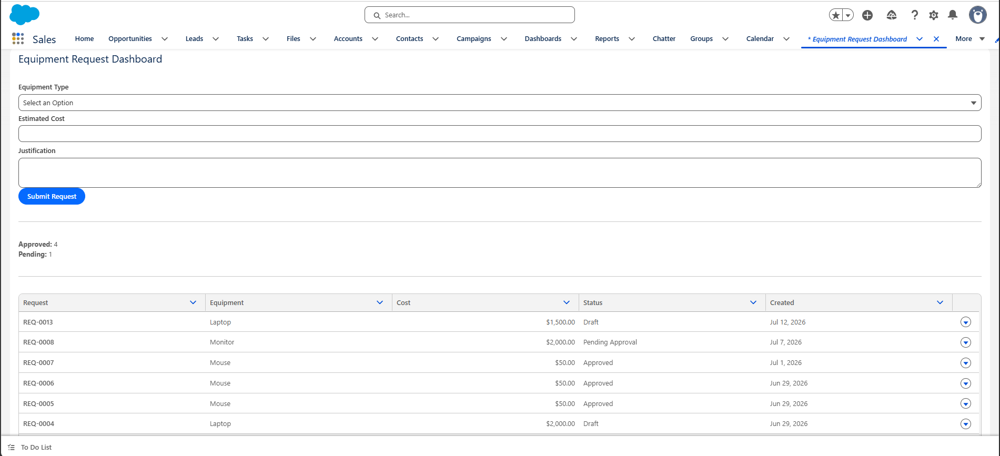
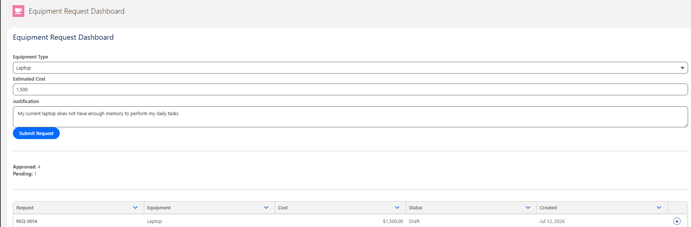
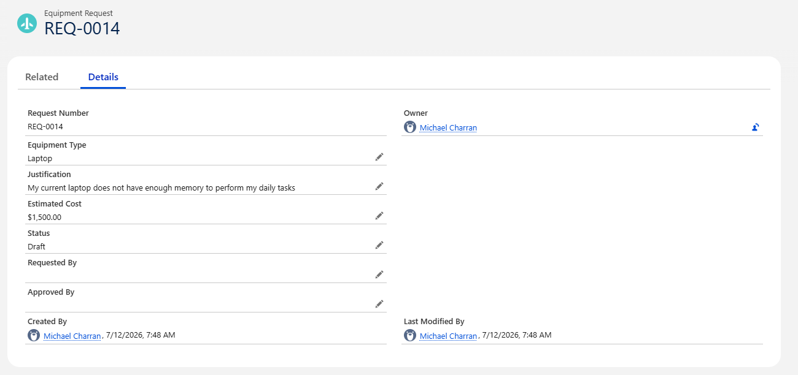
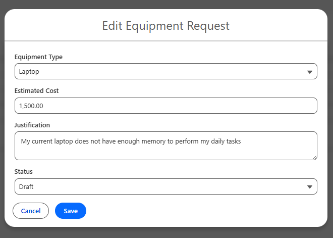
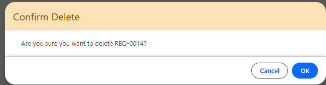
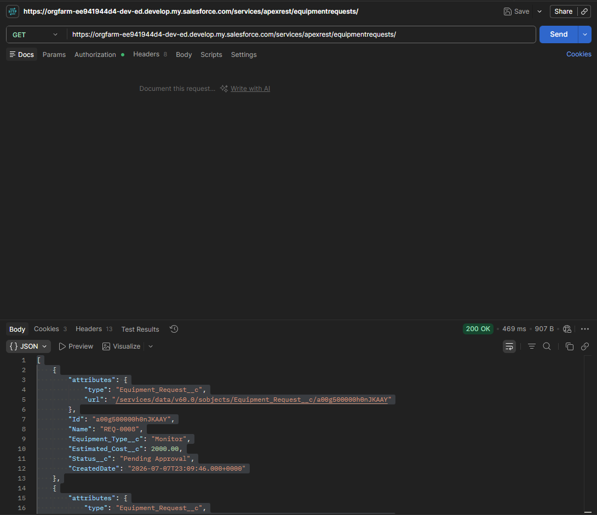
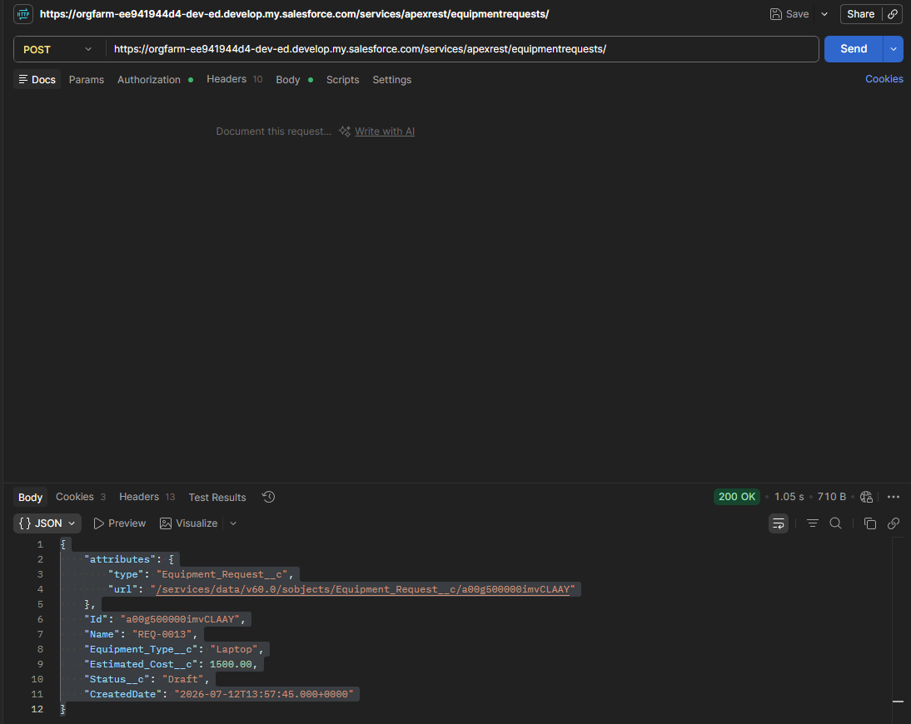

# Salesforce Equipment Request Management System

A full-stack Salesforce application for managing employee equipment requests using Lightning Web Components (LWC), Apex, Salesforce Flows, REST APIs, and OAuth 2.0 authentication.

This project demonstrates end-to-end Salesforce development including custom objects, Apex controllers, Lightning Web Components, Flow automation, REST API development, OAuth authentication, Apex testing, and Salesforce DX deployment.

---

## Features

- Create Equipment Requests from a Lightning Web Component
- View all submitted requests in a Lightning Datatable
- Edit requests using a custom modal
- Delete requests with confirmation dialog
- Automatic approval workflow using Record-Triggered Flows
- Dynamic Equipment Type picklist
- Live dashboard showing:
  - Approved Requests
  - Pending Requests
- Secure REST API
  - GET Equipment Requests
  - POST Equipment Requests
- OAuth 2.0 Authentication
- Postman API Testing
- Apex Unit Tests

---

## Technologies Used

### Salesforce

- Lightning Web Components (LWC)
- Apex
- SOQL
- Record Triggered Flows
- Custom Objects
- Permission Sets
- Salesforce DX

### API & Integration

- Apex REST Services
- OAuth 2.0
- External Client Apps
- Postman

### Development Tools

- Visual Studio Code
- Salesforce CLI
- Git
- GitHub

---

# Application Screenshots

## Equipment Request Dashboard



---

## Create Equipment Request



---

## View Equipment Request



---

## Edit Equipment Request



---

## Delete Equipment Request



---

# REST API

## GET Equipment Requests

Returns all equipment requests as JSON.

**Endpoint**

```
GET /services/apexrest/equipmentrequests/
```

Example Response

```json
[
  {
    "Name": "REQ-0013",
    "Equipment_Type__c": "Laptop",
    "Estimated_Cost__c": 1500,
    "Status__c": "Draft"
  }
]
```

### Postman



---

## POST Equipment Request

Creates a new equipment request.

**Endpoint**

```
POST /services/apexrest/equipmentrequests/
```

Example Request

```json
{
  "equipmentType": "Laptop",
  "estimatedCost": 1500,
  "justification": "Created through Postman"
}
```

Example Response

```json
{
  "Id": "...",
  "Name": "REQ-0013",
  "Equipment_Type__c": "Laptop",
  "Estimated_Cost__c": 1500,
  "Status__c": "Draft"
}
```

### Postman



---

# Project Architecture

```
User
        │
        ▼
Lightning Web Component (Dashboard)
        │
        ▼
Apex Controller
        │
        ▼
SOQL
        │
        ▼
Equipment_Request__c

                 ▲
                 │
OAuth 2.0
                 │
                 ▼
Postman
                 │
                 ▼
Apex REST Service
                 │
                 ▼
Salesforce Database
```

---

# Business Process

1. User submits an Equipment Request.
2. Apex creates the record.
3. Record Triggered Flow evaluates the request.
4. Requests under the approval threshold are automatically approved.
5. Dashboard updates Approved and Pending counts.
6. Users can edit or delete requests.
7. External systems can retrieve or create requests through the REST API.

---

# Testing

Apex Unit Tests were created for:

- GET REST endpoint
- POST REST endpoint
- Record creation
- REST response validation

REST Service Coverage:

**88%**

---

# Future Improvements

- PUT endpoint for updating requests
- DELETE REST endpoint
- Pagination
- Search and filtering
- User authentication and role-based security
- Email notifications
- File attachments
- Approval history

---

# Author

**Michael Charran**

Bachelor of Science in Computer Science

AWS Certified Cloud Practitioner

Salesforce Developer Portfolio Project
